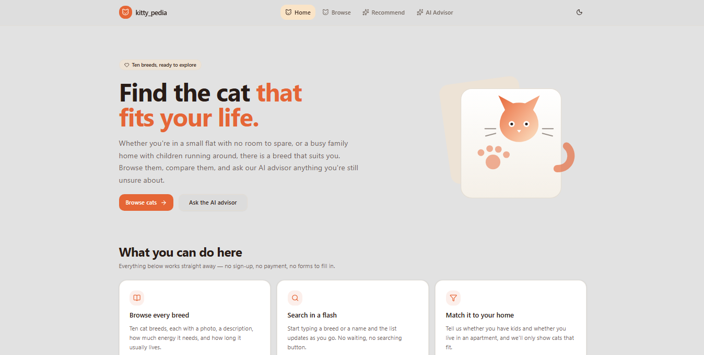
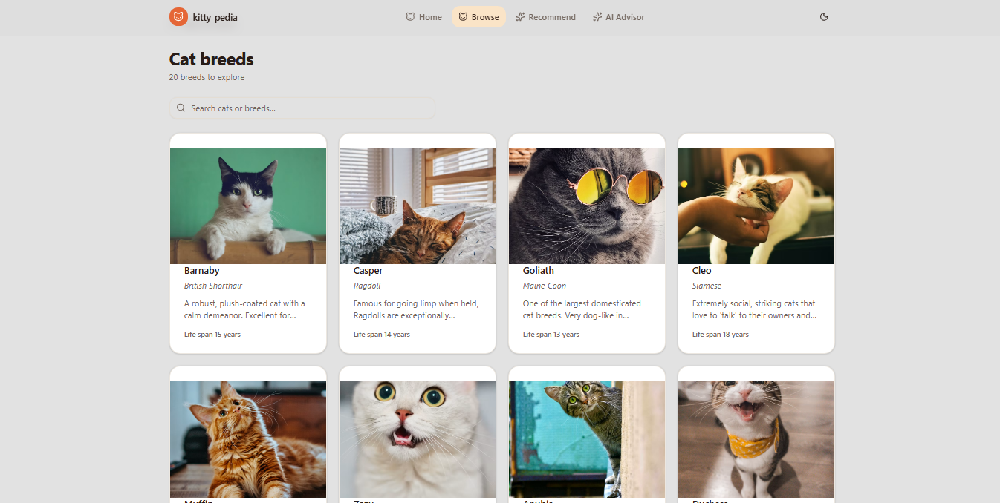
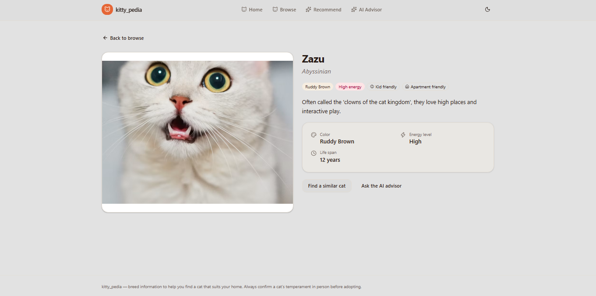
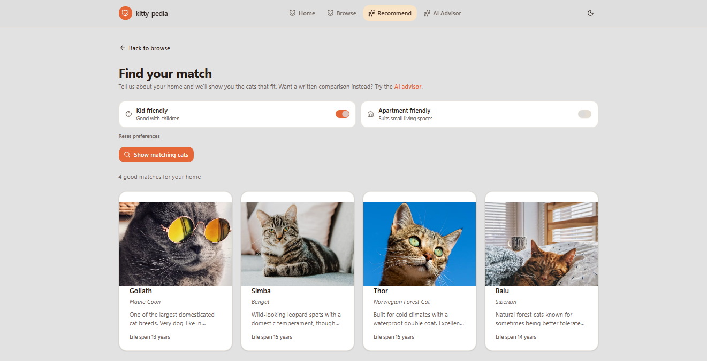
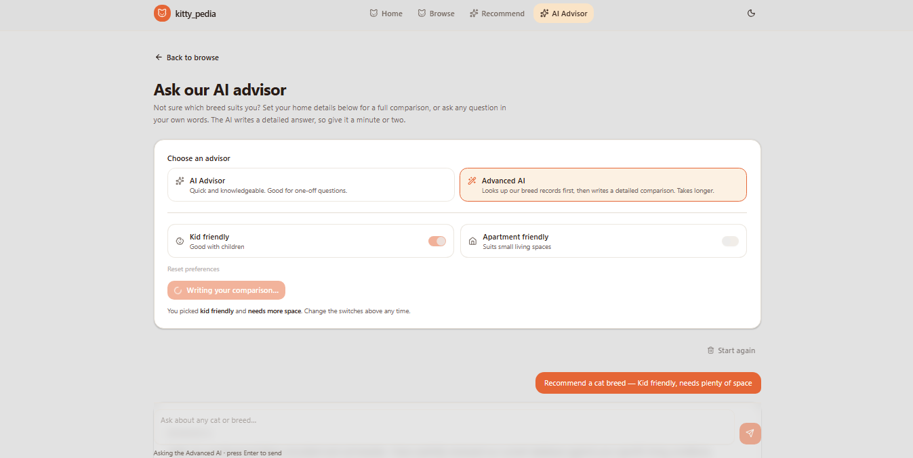
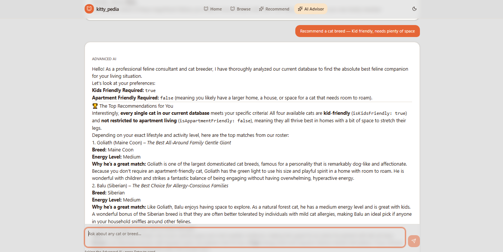

<div align="center">

# 🐱 Kitty Pedia

**A cat-breed encyclopedia with an AI advisor, built as a three-service app.**

Browse cats breeds, filter them by how you live, and ask an AI advisor for a
side-by-side comparison of the breeds that suit you best.

[React](https://react.dev) · [Vite](https://vite.dev) · [TypeScript](https://www.typescriptlang.org) ·
[Tailwind CSS](https://tailwindcss.com) · [Express](https://expressjs.com) ·
[MongoDB](https://www.mongodb.com) · [Gemini](https://ai.google.dev) · [MCP](https://modelcontextprotocol.io)

</div>

---

## Table of contents

- [About](#about)
- [Screenshots](#screenshots)
- [Features](#features)
- [Architecture](#architecture)
- [Tech stack](#tech-stack)
- [Prerequisites](#prerequisites)
- [Quick start](#quick-start)
- [Deploying](#deploying)
- [Available scripts](#available-scripts)
- [Environment variables](#environment-variables)
- [API reference](#api-reference)
- [MCP tools](#mcp-tools)
- [Project structure](#project-structure)
- [License](#license)

---

## About

Kitty-Pedia answers a simple question: **which cat breed actually suits my home?**

Most cat breed sites are either a static list or a generic AI chatbot bolted onto a
side. This project does something narrower and more useful: it holds a real breed
database, filters it by the two constraints that actually matter (children and
living space), and then optionally hands the results to an AI advisor that writes up
a proper comparison in plain English.

The interesting part is the third service. The project ships its own
**Model Context Protocol (MCP) server**, which exposes the cat data as tools. That
means an AI agent — not just a human clicking buttons — can query the database
directly through a standard protocol, and the backend exercises that same path so
you can see it working end to end.

### Who it's for

Anyone adopting or buying a cat and wondering whether a Bengal will survive a
one-bedroom flat, or whether a Ragdoll will tolerate a house full of children.

---

## Screenshots


>
> | Screen | Route |
> | --- | --- |
> | Home / hero | `/` |

> | Breed grid + search | `/browse` |

> | Breed detail | `/browse` → click a card |

> | Lifestyle filter | `/recommend` |

> | AI advisor, with markdown answer | `/advisor` |




---

## Features

### Browse & search

- **20 seeded cat breeds**, each with a photo, breed name, colour, description,
  energy level, lifespan, and kid/apartment suitability.
- **Debounced live search** (300 ms) across cat name and breed — results update as
  you type, no search button.
- Responsive grid from 1 to 4 columns, with skeleton loaders that match the final
  layout so nothing jumps when data arrives.

### Breed detail

- Full profile with colour, energy level and lifespan.
- Suitability badges for kids and apartments, so a poor match is obvious at a
  glance.
- Friendly not-found state for an unknown or removed breed.

### Lifestyle matching

- Toggle **kid friendly** and **apartment friendly** to narrow the list to breeds
  that genuinely fit.
- Clear empty state when a combination has no matches, with a one-click reset.

### AI advisor

Two modes, both user-facing as "AI Advisor" and "Advanced AI":

| Mode | What it does |
| --- | --- |
| **AI Advisor** | Answers a freeform question using Gemini's own knowledge. Fast. |
| **Advanced AI** | Calls the MCP server, which queries the *real* breed records, then writes a detailed comparison grounded in them. |

- Freeform chat with clickable starter questions.
- **A full ranked comparison** of the top 5 breeds for your lifestyle, with match
  scores, pros, cons, key characteristics, and a final recommendation.
- Answers are rendered as formatted markdown (headings, lists, tables).

### Craft

- Light and dark themes, persisted to `localStorage`, applied before first paint so
  a reload never flashes white.
- Fully responsive: horizontal nav on desktop, hamburger drawer on mobile.
- Every page handles loading, error, empty, and success states.
- Keyboard accessible with visible focus rings and ARIA labels throughout.

---

## Architecture

```
┌────────────────────────────────────────────┐
│  Dev:  Frontend :5173   ──►  Backend :3000  │
│  Prod: one process — Backend serves both    │
└────────────┬───────────────────────────────┘
             │  HTTP / JSON  (axios)
             ▼
┌─────────────────────────┐
│   Backend               │   Express 5 + TypeScript
│                         │   Mongoose → MongoDB Atlas
│   REST API (9 routes)   │   Google Gemini (AI answers)
│   Gemini client         │   serves ../public (the built SPA)
└────────────┬────────────┘
             │  POST /api/mcpTest/
             │  1. one long-lived MCP client over stdio
             │  2. calls the recommend_cats tool
             ▼
┌─────────────────────────┐
│   MCP_Server  (stdio)   │   @modelcontextprotocol/server
│                         │   compiled to build/index.js
│   recommend_cats        │──┐
│   getting_allCats       │  │  POSTs back over loopback
└─────────────────────────┘  │
             ▲               │
             └───────────────┘
```

The key point: **the browser only ever talks to the Backend.** The MCP server and
Gemini are both reached server-side, so no API key is ever exposed to the client.

In development the Vite dev server and the API run as separate processes on
different ports. **In production they are the same process** — the Backend serves
the built frontend, so requests are same-origin and CORS is not involved. See
[Deploying](#deploying).

The MCP server is a **child process of the Backend**, not a separate service,
because it speaks stdio transport. It is started once and reused, and it reaches
the API over loopback.

---

## Tech stack

### Frontend — `Frontend/`

| | |
| --- | --- |
| Framework | React 19 + Vite 8 |
| Language | TypeScript 6 (`strict`) |
| Styling | Tailwind CSS v4 (CSS-first `@theme`, no `tailwind.config.js`) |
| Components | shadcn/ui on Radix UI, `lucide-react` icons |
| State | Zustand 5 |
| HTTP | axios |
| Routing | React Router 7 |
| Markdown | react-markdown + remark-gfm |
| Toasts | sonner |
| Linting | oxlint |

### Backend — `Backend/`

| | |
| --- | --- |
| Framework | Express 5 |
| Language | TypeScript (ESM, `nodenext`) |
| Database | MongoDB via Mongoose 9 |
| AI | Google Gemini via `@google/genai` |
| MCP | `@modelcontextprotocol/client` (spawns the MCP server) |
| Middleware | cors, morgan, express.json |

### MCP server — `MCP_Server/`

| | |
| --- | --- |
| Protocol | Model Context Protocol over **stdio** |
| SDK | `@modelcontextprotocol/server` |
| Validation | zod |
| HTTP client | axios (calls back into the Backend) |

---

## Prerequisites

| Requirement | Version | Notes |
| --- | --- | --- |
| **Node.js** | ≥ 20 (tested on 22.21.0) | ESM and `node:` prefixed imports are used |
| **npm** | ≥ 10 | or any equivalent package manager |
| **MongoDB** | 6+ | local, Atlas, or Docker |

You will also need:

- A **MongoDB connection string**
- A **Google Gemini API key** — get one at [aistudio.google.com](https://aistudio.google.com/apikey)

---

## Quick start

Three services, three terminals. **The Backend must be running before the Frontend
will show any data**, and the MCP server is started on demand by the Backend.

### 1. Clone and install

```bash
git clone https://github.com/Ishrz/Kitty-Pedia.git
cd Kitty-Pedia

# install each workspace
cd Backend     && npm install && cd ..
cd MCP_Server  && npm install && cd ..
cd Frontend    && npm install && cd ..
```

### 2. Configure environment

```bash
cp Backend/.env.example Backend/.env    # then fill in the values
cp Frontend/.env.example Frontend/.env  # defaults are fine
```

### 3. Check the database

`Backend/.env` already points at a MongoDB Atlas cluster holding 20 breeds, so
there is normally nothing to do. Confirm with:

```bash
curl http://localhost:3000/api/cat/
```

If your database is empty, create records with:

```bash
curl -X POST http://localhost:3000/api/cat/create \
  -H "Content-Type: application/json" \
  -d '{
    "name": "Simba",
    "color": "Spotted Rosetted",
    "breed": "Bengal",
    "description": "Playful, curious and energetic. Bengals are famous for their spots and love to climb.",
    "image": "https://example.com/images/simba.jpg",
    "isKidsFriendly": true,
    "isAppartmentFriendly": false,
    "lifeSpan": 15,
    "energyLevel": "High"
  }'
```

Repeat for each breed, or write a small seed script — there is no seeder in the repo yet.

### 4. Run the services

```bash
# Terminal 1 — API on http://localhost:3000
cd Backend && npm run dev

# Terminal 2 — app on http://localhost:5173
cd Frontend && npm run dev
```

Open **http://localhost:5173**.

> The MCP server does **not** need to be started manually. `POST /api/mcpTest/`
> starts it as a child process on first use, then reuses it. It is launched as
> `node ../MCP_Server/build/index.js`, so **build it once** before using the
> Advisor:
>
> ```bash
> cd MCP_Server && npm run build
> ```
>
> The Backend resolves that path from its own module location, so it does not
> matter which directory you launch the API from.
>
> To work on the MCP server in isolation, use the inspector:
>
> ```bash
> cd MCP_Server && npm run inspectorui
> ```

### 5. Verify

```bash
curl http://localhost:3000/health
# {"message":"server is running successfully","success":true,"status":200}
```

---

## Deploying

The project is configured to deploy to **Render** as a **single web service**.
A `render.yaml` blueprint at the repo root holds the build and start commands.

One service runs everything, because the MCP server speaks stdio transport and
therefore has to be a child process of the API rather than a service of its own:

```
Render web service
├── Express            → serves /api/*, the built SPA, and the health check
└── MCP server         → compiled to build/index.js, spawned once, reused
                           └── calls back over http://127.0.0.1:$PORT
```

**Before your first deploy**, one Atlas setting needs to change: Network Access
must allow `0.0.0.0/0`, because Render's outbound IPs are dynamic. The cluster
works from your machine today only because your own IP is allowlisted.

Then: **New → Web Service**, connect the repo, apply the blueprint, and enter
`MONGO_URI`, `GEMINI_API_KEY` and `CLIENT_ORIGIN` when prompted.

**[→ Full deployment guide](RENDER_DEPLOYMENT.md)** covers the architecture
rationale, the build command, the verification checklist, and troubleshooting.

### Production notes

- The build sets `VITE_API_URL=` (empty) so the browser calls `/api/…` on the
  same origin. No CORS in production, and the host is never baked into the bundle.
- The health endpoint is `/health`, not `/`, because `/` serves the frontend.
- Advisor responses are cached in the browser for 10 minutes, so revisiting a
  preference combination is instant instead of another ~110 s wait.
- Free-tier instances spin down after 15 minutes idle, so the first request after
  a pause takes roughly a minute to wake up. That is cold start, not an error.

---

## Available scripts

### `Backend`

| Command | Does |
| --- | --- |
| `npm run dev` | Start with nodemon + ts-node, watching for changes |
| `npm start` | Production start — runs `src/server.ts` through `tsx`, no watcher |

### `MCP_Server`

| Command | Does |
| --- | --- |
| `npm run dev` | Start with nodemon |
| `npm run build` | Compile to `build/` — **required before the Advisor works** |
| `npm run start` | Run the compiled server |
| `npm run inspectorui` | Launch the MCP Inspector against the server |

### `Frontend`

| Command | Does |
| --- | --- |
| `npm run dev` | Vite dev server on :5173 |
| `npm run build` | Typecheck, then build to `dist/` |
| `npm run preview` | Serve the production build locally |
| `npm run typecheck` | `tsc -b --noEmit` |
| `npm run lint` | oxlint |
| `npx shadcn@latest add <component>` | Add a shadcn/ui component |

---

## Environment variables

### `Backend/.env`

| Variable | Required | Description |
| --- | --- | --- |
| `PORT` | no | Port for the API. Defaults to `3000`. The MCP server reads it to call back. |
| `MONGO_URI` | yes | MongoDB connection string, e.g. `mongodb+srv://…@cluster0.mongodb.net/kitty_pedia` |
| `GEMINI_API_KEY` | yes | Google Gemini API key. Required by all AI endpoints. |
| `MISTRAL_API_KEY` | no | Present in `.env` but currently unused by any code path. |
| `CLIENT_ORIGIN` | no | Comma-separated CORS allowlist. Defaults to `http://localhost:5173`. Only relevant in development. |
| `API_BASE_URL` | no | Base URL the MCP server calls back on. Defaults to `http://127.0.0.1:$PORT`. |
| `SERVE_SPA` | no | Set to `false` to make `/` return JSON instead of the frontend. |

Missing `MONGO_URI` or `GEMINI_API_KEY` fails at startup with a clear message
rather than surfacing later as a confusing runtime error.

> `.env` is gitignored and must never be committed. Only `VITE_`-prefixed variables
> reach the browser, so the Gemini key stays server-side regardless.

### `Frontend/.env`

| Variable | Required | Default | Description |
| --- | --- | --- | --- |
| `VITE_API_URL` | no | `http://localhost:3000` | Base URL of the Backend. **Set this to empty in production** so requests are same-origin. |

> If you change the frontend's port, update the CORS origin in
> `Backend/src/app.ts` to match, or browser requests will be blocked.

---

## API reference

Base URL: `http://localhost:3000`

The API uses two different response envelopes. `success` is present on the AI and
MCP routes but **absent** from the cat routes.

```jsonc
// cat routes
{ "message": "cat fetched successfully", "data": { /* ... */ } }

// AI / MCP routes
{ "message": "...", "success": true, "data": "markdown string" }
```

| Method | Endpoint | Body / Query | `data` | Notes |
| --- | --- | --- | --- | --- |
| `GET` | `/health` | — | — | Health check. Used by the host platform. |
| `POST` | `/api/cat/create` | cat object | `Cat` | |
| `GET` | `/api/cat/` | — | `Cat[]` | |
| `GET` | `/api/cat/search?q=` | `q: string` | `Cat[]` | Regex over **name and breed only** |
| `GET` | `/api/cat/:id` | — | `Cat \| null` | `200` with `data: null` when unknown; `500` when malformed |
| `POST` | `/api/cat/recommend` | `{ isKidsFriendly, isAppartmentFriendly }` | `Cat[]` | Both booleans must be sent explicitly |
| `POST` | `/api/ai/ask` | `{ prompt: string }` | `string` (markdown) | ~6 s |
| `POST` | `/api/aiRecommend/recommend` | `{ isKidsFriendly, isAppartmentFriendly }` | `string` (markdown) | ~110 s |
| `POST` | `/api/mcpTest/` | `{ isKidsFriendly, isAppartmentFriendly }` | `string` (markdown) | ~111 s, spawns a subprocess |

### The `Cat` model

```ts
{
  _id: string
  name: string
  color: string
  breed: string
  description: string
  energyLevel: string          // "Low" | "Medium" | "High"
  image: string                // URL
  lifeSpan: number             // in years
  isAppartmentFriendly: boolean // sic — misspelled in the schema, kept for compatibility
  isKidsFriendly: boolean
  createdAt: string
  updatedAt: string
  __v: number
}
```

> ⚠️ **`isAppartmentFriendly` is misspelled** in the Mongoose schema, the TypeScript
> interface, the controllers and the service, and therefore in the stored documents.
> It is spelled that way here on purpose. Renaming it is a breaking change requiring
> a database migration.

---

## MCP tools

The MCP server exposes the cat data to any MCP-capable client.

| Tool | Input | Returns |
| --- | --- | --- |
| `recommend_cats` | `{ isKidsFriendly: boolean, isAppartmentFriendly: boolean }` | Matching breeds, JSON-stringified |
| `getting_allCats` | — | All breeds, JSON-stringified |

Run it standalone with the MCP Inspector:

```bash
cd MCP_Server
npm run inspectorui
```

---

## Project structure

```
Kitty-Pedia/
├── Backend/                      # Express API + Gemini client + MCP client
│   └── src/
│       ├── config/               # database connection
│       ├── controllers/          # request handlers
│       ├── models/               # Mongoose schemas
│       ├── routes/               # express routers
│       ├── services/             # business logic
│       ├── types/                # shared TS types
│       ├── utils/                # asyncHandler
│       ├── app.ts                # express app + middleware
│       └── server.ts             # entry point
│
├── MCP_Server/                   # Model Context Protocol server (stdio)
│   └── src/
│       ├── tools/                # tool implementations
│       └── index.ts              # server + tool registration
│
└── Frontend/                     # React SPA
    ├── AGENT.md                  # frontend architecture spec — read before coding
    └── src/
        ├── api/                  # axios instance, per-resource endpoints
        ├── components/
        │   ├── advisor/          # markdown renderer, preference form
        │   ├── cats/             # card, grid, image, badges
        │   ├── common/           # back link, state messages
        │   ├── layout/           # header, page shell, hero art
        │   └── ui/               # shadcn/ui primitives
        ├── hooks/                # debounce, theme, toggle
        ├── lib/                  # cn(), colour palettes
        ├── pages/                # one file per route
        ├── store/                # Zustand stores
        ├── types/                # TypeScript types
        ├── App.tsx               # routes
        └── main.tsx              # entry point
```


---

## License

This project does not have a license file yet. Add one before publishing — e.g.
[`MIT`](https://opensource.org/licenses/MIT) — and update this section.

Third-party code is used under its own license, including shadcn/ui (MIT),
Tailwind CSS (MIT), Radix UI (MIT), and the Model Context Protocol SDK (MIT).

---

<div align="center">

Made with 🐾 for people trying to work out which cat will actually suit them.

[Report an issue](https://github.com/Ishrz/Kitty-Pedia/issues) ·
[Request a feature](https://github.com/Ishrz/Kitty-Pedia/issues/new)

</div>
